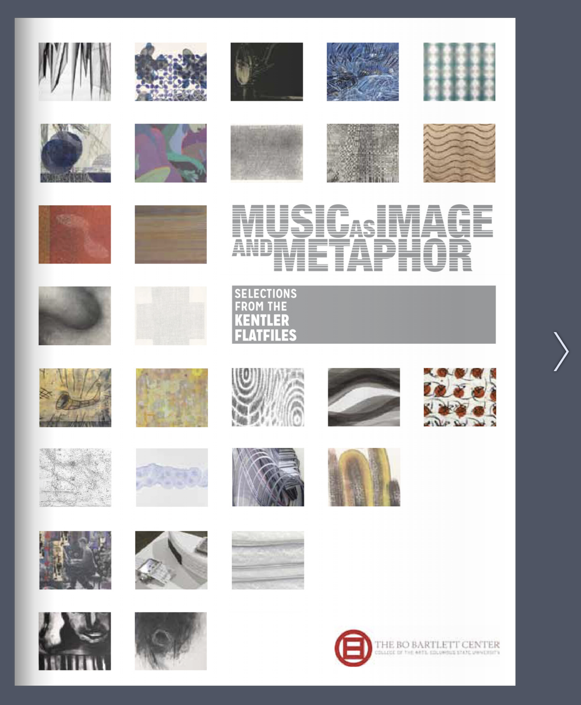

# Cross-modal correspondence between contemporary music & art
This repository contains data and code for reproducing the analyses reported in: 

Fink, L., Fiehn, H. & Wald-Furhmann, M. (2023). The role of audiovisual congruence in aesthetic appreciation of contemporary music and visual art. *Pre-print available at:* [osf.io/hjgc5/](osf.io/hjgc5/)

If using anything from this repository, please cite the paper. 

# About the project
Does congruence between auditory and visual modalities affect aesthetic experience? While cross-modal correspondences between vision and hearing are well-documented, previous studies show conflicting results regarding whether audiovisual correspondence affects subjective aesthetic experience. Here, in collaboration with the Kentler International Drawing Space (NYC, USA), we depart from previous research by using music specifically composed to pair with visual art in the professionally-curated *Music as Image and Metaphor* exhibition. Our pre-registered online experiment consisted of 4 conditions: Audio, Visual, Audio-Visual-Intended (artist-intended pairing of art/music), and Audio-Visual-Random (random shuffling). Participants (N=201) were presented with 16 pieces and could click to proceed to the next piece whenever they liked. We used time spent as an implicit index of aesthetic interest. Additionally, after each piece, participants were asked about their subjective experience (e.g., feeling moved). We found that participants spent significantly more time with Audio, followed by Audiovisual, followed by Visual pieces; however, they felt most moved in the Audiovisual (bi-modal) conditions. Ratings of audiovisual correspondence were significantly higher for the Audiovisual-Intended compared to Audiovisual-Random condition; interestingly, though, there were no significant differences between intended and random conditions on any other subjective rating scale, or for time spent. Collectively, these results call into question the relationship between cross-modal correspondence and aesthetic appreciation. Additionally, the results complicate the use of time spent as an implicit measure of aesthetic experience. 

## Relevant Links
This project is a collaboration with the Kentler International Drawing Space. Their online exhibition of *Music as Image and Metaphor* is available here: [https://www.kentlergallery.org/Detail/exhibitions/442](https://www.kentlergallery.org/Detail/exhibitions/442)

View the catalog from the exhibition here: [https://www.flipsnack.com/bobartlettcenter/music-as-image-and-metaphor.html](https://www.flipsnack.com/bobartlettcenter/music-as-image-and-metaphor.html)

In March 2023, during the final weeks of the exhibition at the Kentler, Lauren Fink joined a panel discussion with the curators and composers (David Houston, Florence Neal, Michael Kowalski, Allen Otte). Watch the hour+ discussion about the curation, composition, and scientific process here: [https://www.kentlergallery.org/Detail/events/540](https://www.kentlergallery.org/Detail/events/540)

You can view a demo of the online scientific experiment here: [https://www.labvanced.com/player.html?id=33023](https://www.labvanced.com/player.html?id=33023)

The pre-registration of experimental design and analyses is available here: [https://osf.io/hjgc5/](https://osf.io/hjgc5/)

# About this repository

## Dependencies
The code was developed in the language R and the RStudio environment (R Core Team, version 1.2.5033). 
The `dependencies.R` file contains all required packages to run the analyses. 

## Usage
As long as the required packages are installed and the directory structure of this repository is unchanged, all code should run on your local machine. 

The core analysis script is `Fink_Kentler_analyses.Rmd`.
To preview the code in a non-executable way, an html file is included: `Fink_Kentler_analyses.nb.html`

Data are in the `data.csv`. 

The `figures` folder contains images submitted for publication, and images used in this README.md file.
By default, the Rmd notebook will plot figures in line. If saving to file is preferred, set op = 1 near the top of the notebook. 

## Supplemental Analyses
Additional analyses, beyond those reported in the manuscript, are included in the code. Enjoy!

